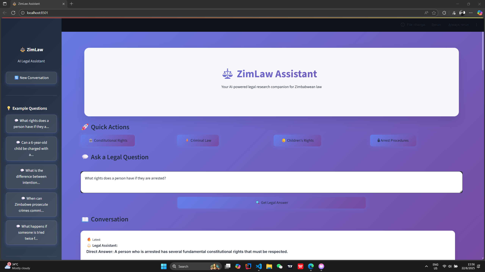

# ZimLaw Assistant

An AI-powered legal assistant for Zimbabwe, built with RAG to help citizens understand their rights under the Constitution and key laws.

## 🎯 Features
- Ask questions about your legal rights
- Get answers with citations (e.g., "Section 15, Constitution")
- Built with open-source tools

## 🛠️ Tech Stack
- LLM: Llama 3 (via Ollama)
- Embeddings: all-MiniLM-L6-v2
- Vector DB: FAISS
- Framework: LangChain
- UI: Streamlit

## 🚀 How to Run
1. Install dependencies: `pip install -r requirements.txt`
2. Run Ollama: `ollama pull llama3`
3. Ingest data: `python src/ingest.py`
4. Launch app: `streamlit run src/app.py`

## 📂 Folder Structure
See project layout.

## 📸 Demo
